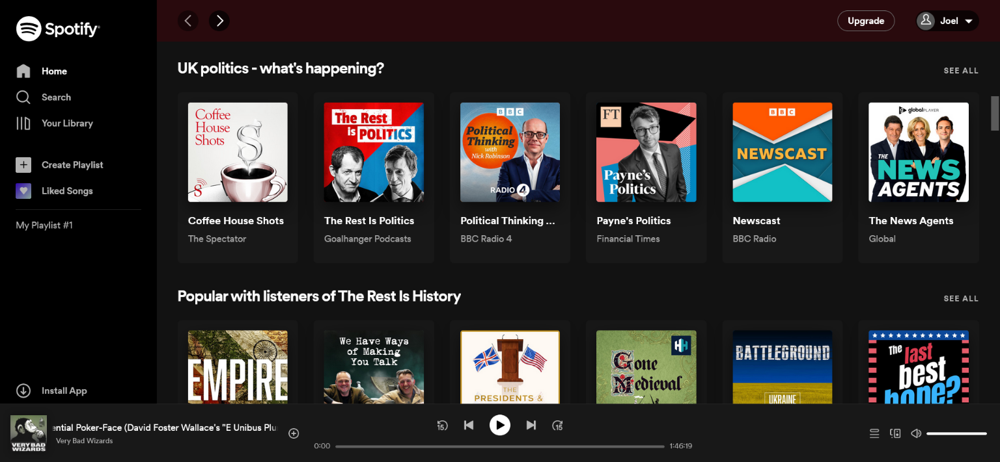

# Joel - Please Read!

As discussed with Ed, my Spotify page is based on the Spotify application layout on my laptop, which looks a little different to the design included in the screenshots. Unfortunately, I forgot to take a screenshot before, since it seems that as of today (Friday 14th), they've slightly changed the header (and some of the colours). However, as I'm really happy with how mine looks, I decided to leave it the same. You can see my screenshot of how the app currently looks below (in order to compare it with mine).

You can see my Spotify clone here (icons take a while to load for me):

https://joelzor.github.io/html-spotify-challenge/

# Spotify

Today we are building the UI for Spotify. This exercise will put into practice everything we have learned about HTML & CSS. Layouts for apps are different to websites so this will put your CSS Grid skills to the test!

## Instructions

In the `screens` folder you will see images of spotify at different resolutions. Your goal is replicate this layout structure as closely as possible. The image assets needed to complete the exercise are in the `assets/img` folder.

For the player icons, you can use your own images or Font Awesome icons (https://fontawesome.com/v4.7/icons/).

## Assesment Criteria

- &#9745; The overall structure of the layout reflects the `spotify-lg.png` reference image.
- &#9745; Fonts, colors and spacings used are similar (they don't need to be identical) to the reference images
- &#9745; CSS avoids repetition.
- &#9745; CSS class names are descriptive.
- &#9745; HTML is semantic and well structured.

### Extension Criteria

- &#9745; The left menu collapses as shown in `spotify-xs.png`.
- &#9745; The list of albums expands and collapses to fill the available page space (see `spotify-md.png` and `spotify-s.png`)
- &#9745; The top navigation list wraps as the page size is reduced.
- &#9745; On hovering over cover images, a play icon appears overlaid.
- &#9745; Only the main content area scrolls - it moves behind the upgrade bar and the player controls. The side menu also stays fixed as the main content scrolls.
