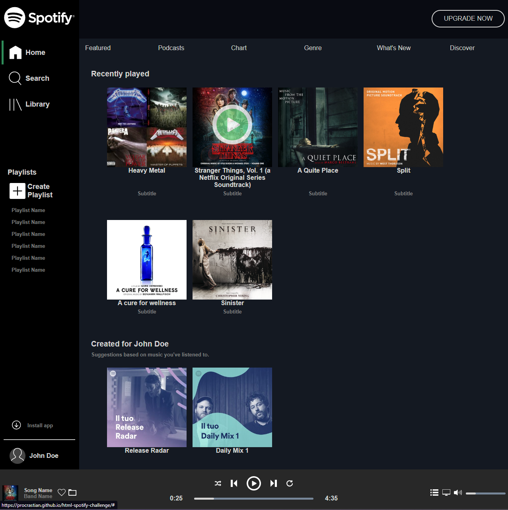

<a name="readme-top"></a>

<!-- PROJECT LOGO -->
<br />
<div align="center">
  <a href="https://github.com/procrastian/html-spotify-challenge">
    
  </a>
<h3 align="center">Spotify UI Design Clone</h3>
  <p align="center">
    My solution to a Boolean UK exercise using HTML and CSS to recreate the Spotify UI based on reference images, using only plain HTML and CSS.
    <br />
    <a href="https://github.com/procrastian/html-spotify-challenge"><strong>Explore the docs »</strong></a>
    <br />
    <br />
    <a href="https://procrastian.github.io/html-spotify-challenge/">View Demo</a>
  </p>
</div>

<!-- TABLE OF CONTENTS -->
<details>
  <summary>Table of Contents</summary>
  <ol>
    <li>
      <a href="#about-the-project">About The Project</a>
      <ul>
        <li><a href="#assignment-brief">Assignment Brief</a></li>
        <li><a href="#built-with">Built With</a></li>
      </ul>
    </li>
    <li>
      <a href="#getting-started">Getting Started</a>
      <ul>
        <li><a href="#installation">Installation</a></li>
      </ul>
    </li>
    <li><a href="#usage">Usage</a></li>
    <li><a href="#roadmap">Roadmap</a></li>
    <li><a href="#contact">Contact</a></li>
  </ol>
</details>

<!-- ABOUT THE PROJECT -->

## About The Project



### Assignment Brief

Today we are building the UI for Spotify. This exercise will put into practice everything we have learned about HTML & CSS. Layouts for apps are different to websites so this will put your CSS Grid skills to the test!

#### Instructions

In the `screens` folder you will see images of spotify at different resolutions. Your goal is replicate this layout structure as closely as possible. The image assets needed to complete the exercise are in the `assets/img` folder.

For the player icons, you can use your own images or Font Awesome icons (https://fontawesome.com/v4.7/icons/).

#### Assesment Criteria

* [x] The overall structure of the layout reflects the `spotify-lg.png` reference image. 
* [x] Fonts, colors and spacings used are similar (they don't need to be identical) to the reference images
* [x] CSS avoids repetition.
* [x] CSS class names are descriptive.
* [x] HTML is semantic and well structured.
* [x] The left menu collapses as shown in `spotify-xs.png`.
* [x] The list of albums expands and collapses to fill the available page space (see `spotify-md.png` and `spotify-s.png`)
* [x] The top navigation list wraps as the page size is reduced.
* [x] On hovering over cover images, a play icon appears overlaid.
* [x] Only the main content area scrolls - it moves behind the upgrade bar and the player controls. The side menu also stays fixed as the main content scrolls.

<p align="right">(<a href="#readme-top">back to top</a>)</p>

### Built With

- [![HTML5][HTML5.js]][HTML5-url]
- [![CSS3][CSS3.js]][CSS3-url]

<p align="right">(<a href="#readme-top">back to top</a>)</p>

<!-- GETTING STARTED -->

## Getting Started

To get a local copy up and running follow these simple example steps.

### Installation

1. Clone the repo
   ```sh
   git clone https://github.com/procrastian/html-spotify-challenge.git
   ```
2. View HTML from an IDE live server
   ```sh
   Open with Live Server
   ```

<p align="right">(<a href="#readme-top">back to top</a>)</p>

<!-- USAGE EXAMPLES -->

## Usage

The main goal with this exercise is to replicate a popular and interactive UI design, with a focus on using CSS `Grid` properties to build the layout from the ground up.


The links and buttons do not direct to additional pages, as this lies outside of the scope of this project.

<p align="right">(<a href="#readme-top">back to top</a>)</p>

<!-- ROADMAP -->

## Roadmap

- [x] Exercise Criteria
- [ ] Update code using new skills
- [ ] Improve Animations

See the [open issues](https://github.com/procrastian/html-spotify-challenge/issues) for a full list of proposed features (and known issues).

<p align="right">(<a href="#readme-top">back to top</a>)</p>

<!-- CONTACT -->

## Contact

[![LinkedIn][linkedin-shield]][linkedin-url]

Ian Grantham - dev.iangrantham@gmail.com

Project Link: [https://github.com/procrastian/html-spotify-challenge](https://github.com/procrastian/html-spotify-challenge)

<p align="right">(<a href="#readme-top">back to top</a>)</p>

<!-- MARKDOWN LINKS & IMAGES -->

[linkedin-shield]: https://img.shields.io/badge/-LinkedIn-black.svg?style=for-the-badge&logo=linkedin&colorB=0A66C2
[linkedin-url]: https://linkedin.com/in/dev-ian-grantham
[HTML5.js]: https://img.shields.io/badge/HTML5-20232A?style=for-the-badge&logo=html5&logoColor=E34F26
[HTML5-url]: https://html.com/
[CSS3.js]: https://img.shields.io/badge/CSS3-20232A?style=for-the-badge&logo=css3&logoColor=1572B6
[CSS3-url]: https://developer.mozilla.org/en-US/docs/Web/CSS
